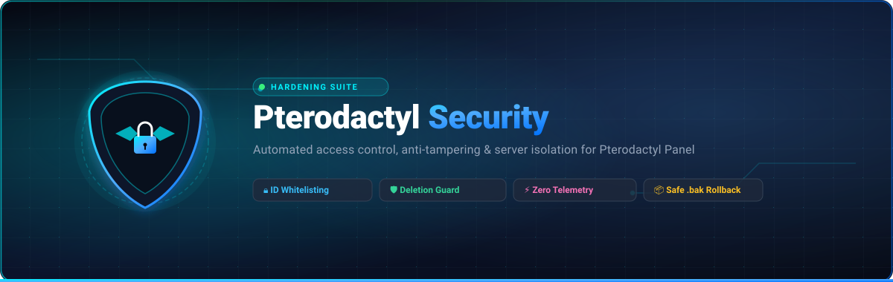
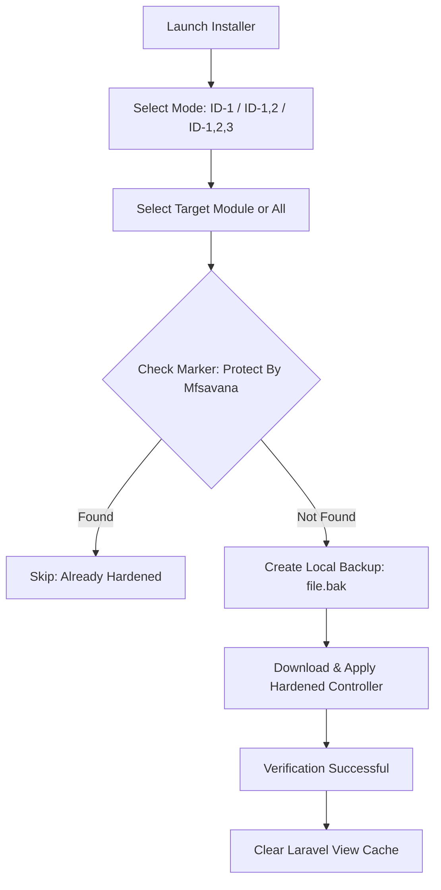

<p align="center">
  
</p>

<p align="center">
  <a href="https://pterodactyl.io"></a>
  <a href="https://www.gnu.org/software/bash/"></a>
  
  
  <a href="#-license"></a>
</p>

<p align="center">
  <strong>Enterprise-grade access control, anti-snooping, and anti-tampering patch suite for Pterodactyl Panel.</strong><br>
  Restricts sensitive panels, blocks unauthorized server file inspection, and prevents destructive actions via strict User ID whitelisting.
</p>

<p align="center">
  <a href="#-quick-start">Quick Start</a> •
  <a href="#-default-vs-hardened">Why This Suite?</a> •
  <a href="#-protection-matrix">Protection Matrix</a> •
  <a href="#-access-control-hierarchy">ID Tiers</a> •
  <a href="#-architecture--how-it-works">Architecture</a> •
  <a href="#-uninstallation--rollback">Rollback</a> •
  <a href="#-troubleshooting--faq">FAQ</a> •
  <a href="#-license">License</a>
</p>

---

## ⚡ Overview

By default, Pterodactyl Panel allows anyone granted administrative rights or specific permissions to view node configurations, browse server files, and alter or destroy panel assets (Eggs, Nests, and Containers). For multi-admin hosting providers, public game hosts, or agencies, this architecture poses significant insider threat risks.

**Pterodactyl Security Installer (MFSAVANA)** provides an automated, non-destructive hardening layer. It injects strict ownership and User ID validation directly into Pterodactyl's core controllers and service providers, guaranteeing that only explicitly authorized administrator IDs can execute high-risk operations.

---

## ⚔️ Default vs. Hardened

| Threat Vector | Standard Pterodactyl Panel | With Pterodactyl Security |
| :--- | :--- | :--- |
| **Server File Snooping** | Any administrator or authorized sub-user can read server files. | 🛡️ **Blocked.** Only the true server owner and whitelisted IDs can view file trees or contents. |
| **Node / Infra Inspection** | Any staff member with admin panel access can inspect node IPs & credentials. | 🛡️ **Blocked.** Access to `Nodes` and `Locations` is restricted to root administrator IDs. |
| **Panel Settings Tampering** | Administrators can view API credentials, SMTP, and system mail configs. | 🛡️ **Protected.** General Settings panel access is blocked for non-whitelisted IDs. |
| **Malicious Server Deletion** | A rogue admin or compromised account can purge game servers permanently. | 🛡️ **Blocked.** `ServerDeletionService` rejects deletion calls unless triggered by allowed IDs. |
| **Egg & Nest Sabotage** | Accidental or malicious deletion of Eggs or Nests breaks existing servers. | 🛡️ **Blocked.** Deletion endpoints are intercepted at controller level with `403 Forbidden`. |
| **Account Modification** | Secondary admins can tamper with owner email, password, or permissions. | 🛡️ **Blocked.** Controller-level guards prevent unauthorized user profile mutations. |
| **Deployment Safety** | Manual file modification carries high risk of syntax errors and downtime. | 🛡️ **Automated.** Non-destructive installer creates automatic `.bak` snapshots for instant rollback. |

---

## 🛡️ Protection Matrix

The suite patches 10 core API and administrative endpoints within `/var/www/pterodactyl/`:

| # | Module Name | Target Controller / Service Path | Risk Mitigated |
| :-: | :--- | :--- | :--- |
| `01` | **Anti File Snooping** | `app/Http/Controllers/Api/Client/Servers/FileController.php` | Stops unauthorized staff from snooping on customer server files, secrets, or configs. |
| `02` | **Location Panel Guard** | `app/Http/Controllers/Admin/LocationController.php` | Locks down access to the server locations management view. |
| `03` | **Node Panel Guard** | `app/Http/Controllers/Admin/Nodes/NodeController.php` | Prevents unauthorized admins from inspecting node IPs, ports, and Wings daemon settings. |
| `04` | **Settings Panel Guard** | `app/Http/Controllers/Admin/Settings/IndexController.php` | Secures global panel configurations, mail setup, and system keys. |
| `05` | **Server Access Guard** | `app/Http/Controllers/Api/Client/Servers/ServerController.php` | Prevents non-owner staff from entering or controlling containers. |
| `06` | **Anti Egg Deletion** | `app/Http/Controllers/Admin/Nests/EggController.php` | Blocks destructive deletion requests targeting panel service eggs. |
| `07` | **Anti Nest Deletion** | `app/Http/Controllers/Admin/Nests/NestController.php` | Blocks destruction of entire nest categories and configurations. |
| `08` | **Anti Server Deletion** | `app/Services/Servers/ServerDeletionService.php` | Hardens the deletion pipeline; forbids purging containers without whitelisted authority. |
| `09` | **Anti Account Tampering** | `app/Http/Controllers/Admin/UserController.php` | Prevents privilege escalation and modifications to root user profiles. |
| `10` | **Anti Server Spec Tampering** | `app/Services/Servers/DetailsModificationService.php` | Restricts modifying server resource quotas (CPU, RAM, Disk allocations). |

---

## 🔐 Access Control Hierarchy

Configure the exact administrative authorization tier during the interactive setup:

```
┌─────────────────────────────────────────────────────────────┐
│                       WHITELIST TIERS                       │
├─────────────────┬─────────────────┬─────────────────────────┤
│ Tier Mode       │ Allowed User ID │ Recommended For         │
├─────────────────┼─────────────────┼─────────────────────────┤
│ [0] ID 1 Only   │ ID: 1           │ Solo Owners / Dedicated │
│ [1] ID 1 & 2    │ IDs: 1, 2       │ Co-Owner Teams          │
│ [2] ID 1, 2 & 3 │ IDs: 1, 2, 3    │ Small Executive Boards  │
└─────────────────┴─────────────────┴─────────────────────────┘
```

> [!NOTE]
> User ID `1` corresponds to the primary administrator account created during initial Pterodactyl setup. All patches dynamically adjust checks according to the selected mode.

---

## 💻 CLI Terminal Interface

```
┌─────────────────────────────────────────────────────────────┐
│                PTERODACTYL SECURITY SUITE                   │
│              Access Hardening & Anti-Tamper                 │
│                   Version 2.0 • @mfsavana                   │
└─────────────────────────────────────────────────────────────┘

Main Menu:
  [1] Install Security Hardening
  [2] Uninstall / Rollback Patches
  [3] Check Protection Status
  ─────────────────────────────────────────────────────────
  [0] Exit

Select an option [0-3]: 1

Select Protection Whitelist Tier:
  [1] Mode 1 : Strict Admin     (User ID: 1 only)
  [2] Mode 2 : Dual Admin       (User IDs: 1 & 2)
  [3] Mode 3 : Executive Team   (User IDs: 1, 2, & 3)
  ─────────────────────────────────────────────────────────
  [0] Back to Main Menu
```

---

## 🚀 Quick Start

### Prerequisites
- **Linux Distribution**: Ubuntu (20.04/22.04/24.04), Debian (11/12), AlmaLinux, or Rocky Linux
- **Pterodactyl Panel**: Installed in standard directory (`/var/www/pterodactyl/`)
- **Permissions**: Root (`sudo`) access
- **Tooling**: `curl` and `bash`

### One-Line Command

Execute the installer directly in your terminal as `root`:

```bash
bash <(curl -fsSL https://pterodactyl-installer.mfsavana.my.id/)
```

### Step-by-Step Walkthrough

1. Run the command above to launch the interactive TUI.
2. Select **`[1] Install Security Hardening`**.
3. Choose your desired **ID Whitelist Tier** (`[1]`, `[2]`, or `[3]`).
4. Choose your deployment scope:
   - **`[A] Install All Modules`** to install all 10 protection modules simultaneously (*recommended*).
   - **`[1]` through `[10]`** to selectively install individual patches.
5. Optionally run **`[3] Check Protection Status`** at any time to verify installed patches.
5. Invalidate the panel view and routing cache:
   ```bash
   cd /var/www/pterodactyl
   php artisan view:clear
   php artisan config:clear
   php artisan route:clear
   php artisan cache:clear
   ```

---

## 🔄 Architecture & How It Works

### Installation Pipeline


### Idempotency & Safety Guarantees
1. **Signature Verification**: Every patch includes the unique header `Protect By Mfsavana`. The installer checks for this signature prior to downloading, guaranteeing zero redundant overwrites.
2. **Pre-Patch Snapshots**: Target files are duplicated as `<filename>.php.bak` before any file write occurs.
3. **Zero Telemetry**: All operations are completely localized. No server tokens, IP addresses, database credentials, or panel telemetry are ever collected or transmitted.

---

## ↩️ Uninstallation & Rollback

If you wish to remove any or all security patches, use the built-in uninstaller:

```bash
bash <(curl -fsSL https://pterodactyl-installer.mfsavana.my.id/)
```

1. Select **`[2] Uninstall / Rollback Patches`**.
2. Select **`[A] Uninstall All Modules`** to restore all original files, or select a specific module number (`[1]` - `[10]`).
3. The script will:
   - Restore the original file from `<filename>.bak` if present.
   - If the `.bak` file was removed, it cleanly downloads the official default controller from the `Uninstall/` directory.
4. Flush the panel cache:
   ```bash
   cd /var/www/pterodactyl
   php artisan view:clear
   php artisan cache:clear
   ```

---

## 🔧 Post-Installation Maintenance

Ensure proper ownership permissions remain assigned to the web server user:

```bash
# Ubuntu / Debian (Nginx / Apache)
chown -R www-data:www-data /var/www/pterodactyl/*

# RHEL / AlmaLinux / Rocky Linux
chown -R nginx:nginx /var/www/pterodactyl/*
# OR: chown -R apache:apache /var/www/pterodactyl/*
```

---

## ❓ Troubleshooting & FAQ

<details>
<summary><strong>Q: What happens when I update Pterodactyl Panel?</strong></summary>
<br>
When you run <code>git pull</code> or download an official Pterodactyl Panel release update, core controller files will be overwritten with default Pterodactyl code. After updating your panel, simply re-run this installer to re-apply the security hardening patches.
</details>

<details>
<summary><strong>Q: I receive an HTTP 403 Forbidden on my own administrator account. Why?</strong></summary>
<br>
Check your database User ID. If your account is not ID <code>1</code> (or whichever tier you selected: <code>ID 1,2</code> or <code>ID 1,2,3</code>), the security guard will deliberately block access. To verify your user ID, run:
<pre><code>php artisan p:user:list</code></pre>
</details>

<details>
<summary><strong>Q: Does this patch alter my database structure or migrations?</strong></summary>
<br>
No. The patches operate purely at the controller and application service level. No database tables, schemas, or migrations are created or altered.
</details>

<details>
<summary><strong>Q: How do I switch from "ID 1 Only" to "ID 1 & 2"?</strong></summary>
<br>
Run the uninstaller (<code>[2]</code> then <code>[A]</code>), then run the installer again selecting Mode <code>[2]</code> (ID 1 &amp; 2).
</details>

---

## 📜 License

This project operates under a **dual-license architecture**:

### 1. Apache License 2.0 (Primary License)
The general repository scaffolding, documentation, uninstaller templates, and public workflow utilities are licensed under the **[Apache License 2.0](LICENSE)**.

### 2. MFSAVANA SECURITY LICENSE v1.0 (Restricted / Source-Available)
The specialized security patch implementations, anti-tampering logic, installer logic, and any file bearing the signature **`Protect By Mfsavana`** are protected under the **[MFSAVANA SECURITY LICENSE v1.0](LICENSE-MFSAVANA.txt)**.

Under this license, the following actions are **strictly prohibited without written authorization**:
- Reuploading or redistributing protected patch files without source attribution.
- Selling, renting, or commercially packaging this tool or its subcomponents.
- Publishing modified redistributions claiming original authorship.
- Removing or obfuscating developer credit lines or security signature headers.

---

<p align="center">
  Developed with focus on panel integrity and operational safety.<br>
  <strong>Developer:</strong> <a href="https://github.com/Qanz4Ever">@mfsavana</a> • © 2025 Qanz4Ever / Mfsavana — All Rights Reserved.
</p>
